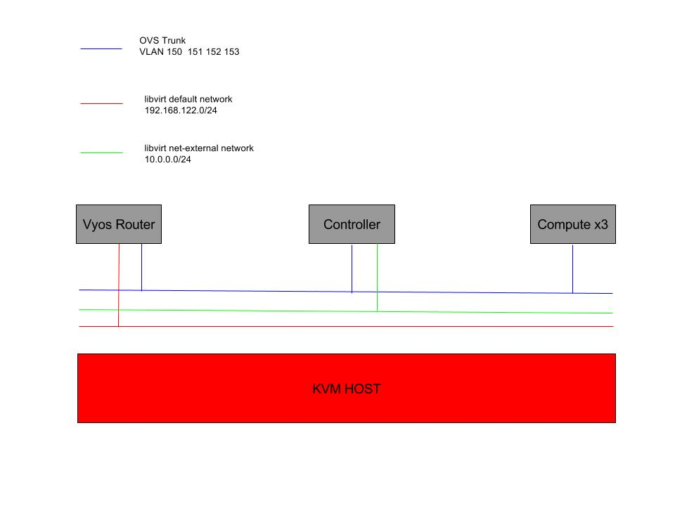

### Synopsis

A set of post deployment playbooks to complete overcloud installation in my test environment.

### Virtual  Environment

Vyos router config:

eth0 : default libvirt network
eth1 : OVS switch trunked port
       10.2.0.1   
       Vif 150  Vlan 150 address 10.2.150.1/24
       Vif 151  Vlan 151 address 10.2.151.1/24
       Vif 152  Vlan 152 address 10.2.152.1/24
       Vif 153  Vlan 153 address 10.2.153.1/24

### Requirements

python-shade is needed

Install shade on CentOS or Rhel

yum install -y epel-release
yum install -y python-pip python-devel libffi-devel openssl-devel gcc
pip install -U pip
pip install shade

Install shade on Fedora

dnf install python-shade

Install shade on Ubuntu

aptitude install python-shade

### Examples and usage

Most of the variable are present in all.yml and can be overridden by the  --extra-vars="" flag

source overcloudrc

##Post deployment tasks
command: ansible-playbook overcloud-postdeploy.yaml

Results:
    - Creation of flat provider network associated with libvirt net-external physical network
    - Creation of associated public subnet
    - Creation of private network and subnet
    - creation of a router with one leg in each of the nets  create earlier

command: ansible-playbook images-sg-keys.yaml

Results:

    - Creation of   flavors, images, security groups and keys

command: ansible-playbook create-provider-network-vlan.yaml  --extra-vars="segmentation=x"

Results:

    - Creation of  vlan provider network and associated subnet

      Change: "cidr:", "segmentation" and "gateway_ip:" to fit your env

## Instance creation and cloudinit examples

command: ansible-playbook instance-provider.yaml

Results:

    - Create instances connected to provider network with volume attached, formated and mounted  
    - Cloudinit is being used to set hostname, create users inject ssh keys, format and mount volume
